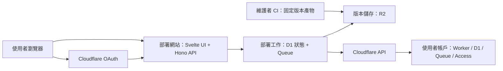

# 全網頁部署與更新實作計畫

狀態：第 0 階段部分線上實測完成；第 1 階段離線版本包、CI artifact、R2 載入驗證與發布乾跑腳本已實作，維護者帳戶實際寫入 R2／latest 未執行；第 2 階段部署 workspace／session／預檢／工作基礎已落地；第 3 階段首次安裝寫入編排與進度畫面已接上（含 Direct Upload `session.buckets`）；第 4 階段網頁更新（版本比較、維護模式、migration、復原點）已接上（測試以 mock Cloudflare API 與記憶體 R2，未對正式帳戶寫入）。更新日期：2026-09-18。

本文件規劃免 GitHub 帳號、免下載、免終端機的部署流程，不代表現有功能已支援。第 0 階段發現見 [`docs/006-stage0-capability-verification.md`](./006-stage0-capability-verification.md)。2026-09-18 已在使用者指定帳戶建立獨立測試資源，實測範圍與未完成項目見能力驗證紀錄末節。

## 1. 目標與第一版範圍

使用者透過部署網站登入 Cloudflare、選擇帳戶、設定允許登入的 Email，便可將「不用記帳」部署到自己的 Cloudflare 帳戶。銀行憑證與金融資料繼續由使用者的 Worker／D1 處理。

第一版包含：

- Cloudflare OAuth 授權與帳戶選擇。
- 新安裝的資源建立、登入保護、金鑰產生與部署。
- 可重新整理、重試及重新授權的部署進度頁。
- 由同一部署網站執行手動版本更新。
- 手機與桌面瀏覽器可完成全部使用者操作。

第一版不包含：背景自動更新、既有 GitHub 部署接管、自訂網域、多使用者財務資料隔離、任意分支部署及使用者修改程式碼後的合併。既有 Deploy to Cloudflare 與 GitHub 更新路徑保留，直到另行完成遷移設計。

「免下載」指使用者不必下載安裝器、原始碼或版本包；前端正常載入網頁資源不受此限制。維護者仍可使用 GitHub CI 建置及發布版本。

## 2. 已確認能力與待驗證項目

第 0 階段的 API／文件對照、Dashboard 深連結、Access 路徑、D1 ledger 建議與成本表見 [`docs/006-stage0-capability-verification.md`](./006-stage0-capability-verification.md)。下列為計畫層摘要。

### 已由文件／API 證實（尚未線上寫入實測）

- 現行 README 與 `docs/005-deployment.md` 的 GitHub 依賴來自部署 repository、Workers Builds 與同步上游 workflow，應用執行本身沒有此依賴。
- `scripts/deploy-with-vapid.mjs` 已有 Queue 建立與 VAPID 金鑰保留邏輯；新流程沿用其行為規則，不能在 Worker 直接執行這支 Node 子程序腳本。
- `wrangler.toml` 定義 Worker、靜態資源、D1、Queue producer／consumer、Browser、AI 及 Cron，均須納入新部署流程。
- Cloudflare 已公開自行建立 OAuth client 的流程；公開 client 可供其他帳戶使用，需要完成網域驗證。採官方 client 註冊，不借用 Wrangler 的 client ID。[官方建立文件](https://developers.cloudflare.com/fundamentals/oauth/create-an-oauth-client/)
- Cloudflare 提供 OAuth 授權、token、撤銷及使用者資訊端點；PKCE `S256` 與 `refresh_token`／`offline_access` 出現在 OpenID 設定。[官方整合文件](https://developers.cloudflare.com/fundamentals/oauth/integrate-with-cloudflare/)
- Worker 靜態資源可透過 API upload session 上傳，再用完成憑證與 Worker 部署綁定，不必為每位使用者建立 Git repository。[Direct Uploads](https://developers.cloudflare.com/workers/static-assets/direct-upload/)
- 目標帳戶可用 REST 建立 D1、Queue、Queue consumer、Worker secrets，以及啟用／關閉該 script 的 workers.dev（含關閉 preview）。
- Access Application 的 `destinations` 支援 `type: "worker"`，可對單一 Worker 套用 Access，不要求使用者自有 zone。Email OTP 可用 REST 新增；policy 可 `include` 單一 email。Organization `auth_domain` 與 Application `aud` 可讀出，對應 `TEAM_DOMAIN`／`POLICY_AUD`。
- Wrangler 遠端 migration 走 D1 `/query`，ledger 為 `d1_migrations(id, name, applied_at)`；一個檔案加一筆 `INSERT` 作為一次請求。不可用分號天真拆 SQL。

### 第 0 階段結論（2026-09-17）

| 項目          | 文件結論                                                                                                                                                 | 未通過或未實測時的處理                                                                |
| ------------- | -------------------------------------------------------------------------------------------------------------------------------------------------------- | ------------------------------------------------------------------------------------- |
| OAuth scopes  | 應對齊 token permissions：Workers Scripts、D1、Queues、Access Apps and Policies、Org／IdP、Memberships。範例 `workers-platform.write` 不足以當完整目錄。 | 隔離帳戶用 `GET /oauth/scopes` 回填 ID；缺 scope 則縮小功能或記為阻塞，不改用過度授權 |
| 全新帳戶      | workers.dev 子網域 API 存在；Zero Trust 開通文件要求 Dashboard 選方案並填付款資料（Free 仍要填）。不得宣稱零人工步驟。                                   | 預檢 + 深連結；缺組織則停在可續跑狀態                                                 |
| Access        | REST 路徑已見於 Application `worker` destination + OTP IdP + email allow。`worker_id` 實際值與一鍵 Access 是否完全等價待實測。                           | API 失敗則引導 Dashboard 一鍵 Access；成功前不開放入口                                |
| D1 migrations | REST runner 應模仿 Wrangler ledger 與每檔一次 `/query`。REST 是否原子回滾未由文件保證。`0044` 為大表重建。                                               | 先在隔離帳戶重播；非原子則改 `/import` 或受控 Wrangler runner                         |
| 更新一致性    | Queue 可 pause delivery；D1 Time Travel 可當復原點。同步中更新仍屬第 4 階段。                                                                            | 未實測前不得開放含 schema 變更的更新                                                  |
| 資源與成本    | 使用者端與現行 Free 額度相同（含 10 ms CPU、每日 10 分鐘 Browser Run）。部署服務本身建議 Paid，因 Free subrequest／CPU 不夠編排完整安裝。                | 明示限制，不承諾永久零成本                                                            |

**Go／no-go：** 沒有已證實的 API 硬阻塞，第 1 階段可以開始做版本產物設計。在 Ted 隔離帳戶完成最小安裝實測前，不開始第 2 階段 workspace，也不把 REST migration 當成已保證原子。若 OAuth 無法同時取得 Workers＋D1＋Queues＋Access，或 Access 無法保護 workers.dev 且無法用 Dashboard 深連結補齊，再列為產品阻塞。

## 3. 使用者流程

### 首次安裝

1. 開啟部署網站，看到資料所在位置、需要的 Cloudflare 權限與「使用 Cloudflare 繼續」。
2. 前往官方 OAuth 頁面登入及授權，返回後只列出實際授權的帳戶。
3. 選擇帳戶並填寫允許登入的 Email；不假設 OAuth 身分一定有可用且已驗證的 Email。
4. 執行唯讀預檢。缺少帳戶啟用設定時提供對應 Dashboard 連結，完成後可回來續做。
5. 顯示帳戶、安裝名稱、目標版本與即將建立的資源；按「建立我的不用記帳」開始寫入。
6. 顯示「準備環境 → 設定登入保護 → 安裝版本 → 驗證完成」，錯誤提供具體下一步。
7. 完成後開啟私人網站，實際通過 Access 登入，再設定資料來源。

部署網站不收集銀行帳密。首次存取測試同時驗證未授權請求遭拒與授權使用者可進入；單純 HTTP 200 或 Access redirect 不代表安裝成功。

### 手動更新

1. 回到部署網站重新授權，取得可管理的安裝與目前版本。
2. 顯示新版本、migration 與預期中斷資訊，按「更新」。
3. 預檢後套用版本，保留 D1、Access policy、加密金鑰與 VAPID 金鑰。
4. 顯示更新結果；失敗保留可恢復的狀態及明確操作，不要求下載或執行指令。

第一版每次安裝／更新重新取得部署授權，不長期保存 refresh token，也不承諾一鍵背景更新。部署任務執行期間的短期憑證需加密保存並設 TTL；完成、取消或過期後清除。清除本機副本與撤銷 Cloudflare 授權是不同動作，撤銷語意於第 0 階段驗證。

## 4. 建議架構

部署服務由維護者營運，獨立於每位使用者的財務應用。採預先建置的版本產物；部署過程不執行 npm install、Git clone 或使用者提供的程式碼。

建議新增兩個 workspace：

- `apps/deployer-web`：授權、預檢、安裝／更新與進度畫面，沿用 Svelte 5 與 feature-first 組織。
- `apps/deployer-worker`：Hono API、OAuth session、版本讀取、部署工作與 Cloudflare API adapter；依 auth、installations、deployments 分 feature。

部署服務的 D1 schema／migrations 放在自己的 workspace，避免混入使用者金融資料庫。先不建立共用部署框架或抽取整套 UI library。必要時才將確實共用的 manifest／版本型別抽成小型 package。

### 持久狀態與身分邊界

- 安裝紀錄：installation ID、授權帳戶 ID、Worker／D1／Queue／Access IDs、版本、狀態、時間。
- 工作紀錄：目標版本、步驟、lease、重試次數、已建立資源、去敏錯誤碼與 migration 進度。
- 短期授權紀錄：加密 token、到期時間、session 關聯；與可長期保留的部署紀錄分開。
- 每個查詢與寫入均檢查 session 及目前帳戶權限；知道 installation ID 不代表有管理權限。
- Cookie 採 HttpOnly、Secure、適當 SameSite；OAuth state、固定 callback allowlist 與 CSRF 驗證涵蓋整個流程。Authorization Code 流程由後端交換 token，client secret 不進瀏覽器；PKCE 支援於 spike 一併驗證。

部署服務正常運作不讀取金融明細，但具部署／D1 權限期間技術上可能接觸資料，不能宣稱其絕對無法存取。產品說明要精確交代這個信任邊界。

## 5. 版本產物與部署執行

### 版本包

維護者 CI 在必要檢查通過後，產生不可覆寫的版本目錄，包含：

- Worker ESM bundle、外部 module／WASM 等必要檔案。
- Web 靜態資源及 API 要求的 asset manifest。
- 原始 SQL migrations 與 checksum。
- Release manifest：版本、commit SHA、產物摘要、compatibility date／flags、bindings、Cron／Queue 設定及允許的升級來源。

建立例如 `scripts/build-release.mjs`；版本只從維護者控制的 R2 位置讀取，拒絕任意 artifact URL。發布指標只在產物完整且驗證成功後更新；部署任務建立時固定版本與摘要，重試不重新解讀 latest。

### 首次部署順序

1. 驗證授權、帳戶前置條件、版本與名稱衝突。
2. 鎖定 installation，記錄工作與預定資源名稱。
3. 建立專屬 D1、Queue；依 API 需求建立不開放財務功能的 bootstrap Worker。
4. 完成 Access 保護並取得 Team Domain／AUD；不修改帳戶既有共用登入設定，不加入 bypass policy。
5. 套用 migrations，建立並寫入 `CONFIG_ENCRYPTION_KEY` 及 VAPID secrets。
6. 上傳 assets 與正式 Worker，綁定 DB、BROWSER、AI、ASSETS、SYNC_QUEUE，確保 DEMO_MODE／LOCAL_DEV_MODE 未啟用，preview URL 不形成旁路。
7. 確認 schema、secrets 與保護設定完成後，再啟用 Queue consumer、Cron 與公開入口。
8. 驗證設定及實際登入流程，記錄安裝版本並清除短期敏感資料。

具體 API 順序由第 0 階段決定；若建立 Access 必須先有公開 hostname，bootstrap 必須回應拒絕或維護畫面，且不連接財務資料路由。

金鑰第一次產生後，在工作重試期間加密暫存；寫入結果不確定時核對步驟，不能換一把新金鑰覆蓋。成功後金鑰保留於目標 Worker secrets，部署服務移除暫存副本。更新只檢查存在與保留，不要求讀回原文。

### 重試與失敗處理

- 工作以 D1 lease 防止同一安裝同時執行；Queue 訊息只帶工作 ID，不帶 token 或金鑰。
- 每個步驟記錄遠端 resource ID；遠端建立成功但本地寫入失敗時，重試先辨識原資源，不盲目重建。
- 同名且無法證明屬於本安裝的資源視為衝突，不覆寫或自動接管。
- 429／暫時性 5xx 有界重試；權限不足、額度、需帳戶啟用與憑證失效分別回報。憑證失效進入待重新授權，續跑原工作。
- 不用單次 HTTP request 或單純 waitUntil 承擔整個安裝；進度可輪詢，重新整理不重複部署。
- 失敗保留已建立資源供續跑，不自動刪除 D1。取消停止後續步驟，清楚列出剩餘資源。

## 6. D1 與更新策略

現有 migrations 由 Wrangler 管理。網頁部署若改用 REST executor，必須保留既有 SQL 語意及相容的 migration ledger，並以完整 migration 重播與實際版本升級驗證，不能只測空白資料庫。

第 0 階段先確認 API 能否提供每個 migration 的原子執行及失敗恢復。若無法相容，改為評估維護者端受控 runner 執行原生 Wrangler；使用者仍全程網頁操作，但須重新評估 runner 的成本與憑證隔離。不可將未知能力直接寫成已完成設計。

更新需涵蓋：

- 固定 target release，檢查 current version 與 schema 相容性。
- 有 migration 時先阻止新的手動／排程同步，等待既有執行中的工作安全結束；Queue 重送、Cron 與分段同步均須納入。
- 在使用者帳戶建立可驗證的復原點／備份策略，不將金融資料搬到部署服務。
- 套用 migration、部署新版本、確認登入及讀寫可用，再恢復同步。
- 在程式版本與 schema 相容時才允許程式回滾；不自動倒跑 SQL 或把 Worker rollback 當成資料庫回復。

同步維護模式只在實作更新階段加入既有 Worker 的必要入口，不重構 connector。既有 GitHub 安裝的接管需另處理 Workers Builds 競爭、現有金鑰與安裝識別，第一版拒絕直接覆寫。

## 7. 實作階段與驗收

| 階段              | 交付內容                                                                                                                              | 驗收／完成條件                                                                                         |
| ----------------- | ------------------------------------------------------------------------------------------------------------------------------------- | ------------------------------------------------------------------------------------------------------ |
| 0：能力驗證       | OAuth scope/API 對照表、全新帳戶與 Access 路徑、migration 原型、成本與執行限制紀錄（見 `docs/006-stage0-capability-verification.md`） | 文件／API 對照已完成。隔離測試帳戶的完整最小安裝仍待 Ted 授權後實測；每個需 Dashboard 操作的步驟已明列 |
| 1：版本發布       | Release manifest、建置腳本、R2 發布流程                                                                                               | 固定版本可重現安裝；產物完整，摘要不符即拒絕；既有部署不受影響                                         |
| 2：授權與工作基礎 | 兩個部署 workspace、session、帳戶預檢、D1 工作紀錄、Queue consumer                                                                    | 跨帳戶存取被拒；撤銷／過期可恢復；重送不建立第二個安裝                                                 |
| 3：首次安裝       | D1／Queue／Access／secrets／assets／Worker／Cron 全流程與進度 UI                                                                      | 無 GitHub、無本機工具的新使用者可在桌面與手機完成安裝及登入                                            |
| 4：網頁更新       | 版本比較、重新授權、維護模式、migration 與恢復                                                                                        | 以含合成資料的舊版升級，資料、設定及金鑰不變；失敗可恢復                                               |
| 5：上線準備       | 維護者正式 OAuth client／網域、營運清理與配額、文件與試用                                                                             | 非維護者帳戶端到端通過；無敏感 log；部署服務故障不影響既有財務網站                                     |

開發依序進行，先完成階段 0，避免同時鋪開全部功能。每階段可各自拆 PR。階段 0 的文件／API 驗證已寫入 `docs/006-stage0-capability-verification.md`。2026-09-18 曾在指定帳戶建立獨立測試資源（後續已刪除 D1、Queue 與 consumer，測試 Worker 暫留供登入驗證），未修改既有 `taiwan-fin-hub` 資源。

### 必要測試

- 部署狀態機：重複訊息、建立結果不確定、部分失敗與 token 過期續跑。
- 權限：錯誤帳戶、猜測 installation ID、OAuth state／CSRF、跨 session 工作存取。
- 金鑰：新裝產生一次、重試不輪替、更新保留；log／錯誤／Queue payload 無敏感值。
- Migration：完整重播、實際舊版 fixture 升級、失敗不錯記完成、同步中更新的阻擋與恢復。
- Access：未登入／錯誤使用者被拒、允許使用者成功；workers.dev 與 preview 不繞過保護。
- Playwright：手機／桌面授權返回、Dashboard 前置步驟返回、重新整理、重試與更新。
- 隔離線上測試：真實 OAuth、資源建立與 bindings／assets／Access；mock 測試不替代平台驗證。

一般 PR 按根目錄規範執行 format:check → typecheck → 適用的 backend／unit tests；新增 workspace 納入 CI，release 額外通過 build。瀏覽器及線上測試聚焦上述主要流程。

## 8. 文件與營運交付

功能上線時更新 README 的主要安裝入口及 `docs/005-deployment.md`，保留既有 GitHub 使用者的文件。新增 workspace 時更新 AGENTS.md 的目錄責任及驗證指令；前後端架構文件補部署服務邊界。金融 schema 若變更，依既有 schema metadata／產生文件流程辦理。

維護者需準備部署網站網域、OAuth client、R2 版本空間、部署服務 D1／Queue 與加密 secret。先使用 private client 測試；公開前完成官方所需資料與網域驗證。部署服務設工作數量限制、憑證 TTL 清理、去敏稽核及錯誤監控；不記錄銀行資料或整份 API response。

第一版完成標準：一名沒有 GitHub 帳號、沒有開發工具的使用者，能只透過瀏覽器建立私人財務網站，之後回到部署網站完成版本更新，且全程不需貼 API Token、複製 Secret 或下載檔案。若 Cloudflare 帳戶首次啟用仍有必要人工步驟，介面需引導並可續跑，不能隱藏此限制。

## 9. 2026-09-18 實作進度

- 已新增 `scripts/build-release.mjs`、`scripts/verify-release.mjs`、`scripts/publish-release.mjs` 與 `scripts/release/artifact.mjs`，產生含 SHA-256 與 Direct Upload asset hash 的固定版本包，並以乾跑列出 R2 物件鍵。
- 原始 SQL 保留位元組，Worker 使用固定 Wrangler dry-run 的 multipart modules；公開 config 不接受帳戶 ID、私人 bindings 或未支援的頂層設定。
- 已新增產物完整性、重建一致性、敏感 binding、symlink／路徑穿越、資源 hash 與發布乾跑測試，納入 `test:deploy`／`test:backend`。
- CI 在原有驗證後建置、驗證並保留 artifact。不會自動執行 `release:publish --execute`，也未認證 `allowedUpgradeFrom`。
- 已實測 D1 migration、代表性回滾、Worker bindings、Queue consumer、Cron、Access 建立及匿名攔截。OAuth client 建立被目前 MCP 憑證的 Authentication error 阻擋，使用者登入及實際 token 流程尚待完成。
- 已新增 `apps/deployer-web` 與 `apps/deployer-worker`：OAuth Authorization Code + PKCE session、帳戶預檢、安裝／工作 D1 schema、Queue consumer。跨帳戶存取回 404／403，重送同一 Worker 名稱不會建立第二筆安裝；token 過期的工作進入 `awaiting_reauth`。
- 第 3 階段已接上首次安裝步驟機：Queue 每次 invocation 只跑一步，依序建立 D1／Queue／bootstrap Worker／Access／migrations／secrets／assets／正式 Worker／consumer／Cron，並提供「準備環境 → 設定登入保護 → 安裝版本 → 驗證完成」進度畫面。沒有 R2 版本包且非本機 fixture 時工作進入 `awaiting_release`，不對目標帳戶寫入。綁定 `RELEASE_BUCKET` 時驗證 `release.json`／`files[].sha256`，並依 Direct Upload `session.buckets` 分批上傳資產、部署全部 Worker modules。金鑰產生一次並加密暫存，重試不輪替；成功後清除部署服務上的副本。測試以 mock Cloudflare API 與記憶體 R2 覆蓋，未對正式 `taiwan-fin-hub` 資源寫入。
- 第 4 階段已接上網頁更新：ready 安裝可讀取 update-plan、比較 `allowedUpgradeFrom`、進入維護模式（暫停 Queue delivery、清空 Cron、寫入 `DEPLOY_MAINTENANCE`）、等待 inflight、建立 D1 Time Travel bookmark、只套用尚未記入 ledger 的 migration、檢查既有 secrets 而不輪替金鑰，再部署新版本並恢復同步。失敗將安裝標為 `update_failed` 並保留復原點，不自動倒跑 SQL。金融 Worker 在 `DEPLOY_MAINTENANCE` 期間拒絕新的手動同步，也不啟動新的排程 tick；已在途的發票／集保分段會做完當下這段、不再 enqueue continuation。本機 fixture 可從 `dev-local`／`v0.1.0` 升到 `dev-local-2`（含 `0002_probe_note.sql`）。測試仍以 mock Cloudflare API 覆蓋。
- 正式 OAuth client、維護者帳戶實際寫入 R2 latest，以及非維護者帳戶的端到端登入驗證仍屬後續階段。不能將目前成果描述為可供一般使用者一鍵部署。
